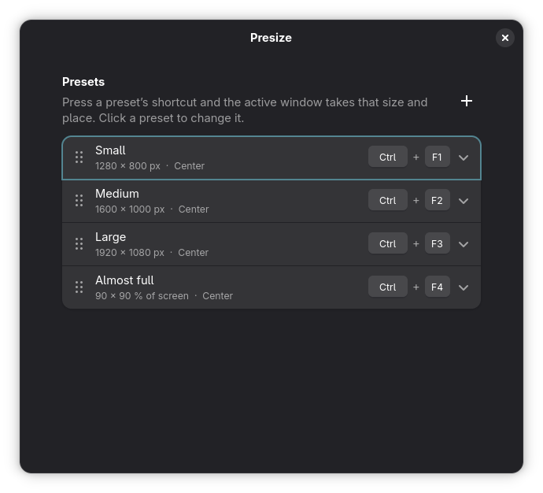

# Presize

A GNOME Shell extension that resizes the active window to a preset size and puts it
where you want, with one keyboard shortcut. No tiling, no grids, no layouts.
Just "make this window 1600 × 1000 and center it".

Designed so that anyone can set it up: every preset is a name, a size, a place on the
screen and a shortcut, all edited in a normal GNOME preferences window.



## Features

- Any number of presets, each with its own shortcut.
- Size in pixels or as a percentage of the screen.
- Place the window in the center, at an edge, in a corner, or leave it where it is.
- Works on Wayland and X11, on any monitor the window is on.
- Un-maximizes and leaves fullscreen before resizing.
- Warns when a shortcut is already taken by GNOME or another preset, and never touches GNOME's own shortcuts.

Default presets: Ctrl+F1 to Ctrl+F4 for four sizes, all centered.

## Install

Presize is distributed through [GitHub releases](https://github.com/tenebra-pl/presize/releases),
not through extensions.gnome.org.

Download the latest zip and install it:

```bash
curl -LO https://github.com/tenebra-pl/presize/releases/latest/download/presize@tenebra.shell-extension.zip
gnome-extensions install --force presize@tenebra.shell-extension.zip
```

Then log out and back in (Wayland) or restart the shell with Alt+F2, `r` (X11), and
enable it:

```bash
gnome-extensions enable presize@tenebra
```

Open the settings from the Extensions app or with `gnome-extensions prefs presize@tenebra`.
To update, repeat the two install commands with the new release and log out and back
in again.

To install from source instead, clone the repository and run `make install`.

## Development

- `src/` is the extension, `po/` holds translations.
- `make build` compiles the schema and translations into `build/`.
- `make install` symlinks `build/` into the extensions folder.
- `make pack` produces the installable zip attached to GitHub releases.
- `make pot` refreshes the translation template after changing strings.

After changing `extension.js` or `presets.js`, log out and back in (Wayland).
After changing only `prefs.js`, kill the process that hosts extension preferences
and reopen the settings; it restarts on demand:

```bash
pkill -f "gjs -m /usr/share/gnome-shell/org.gnome.Shell.Extensions"
```

Requires GNOME Shell 48 or newer.

### Releasing a version

Versions are git tags. The `version-name` field in `metadata.json` is filled in at
build time from the tag.

```bash
git tag -a v1.0.0 -m "Presize 1.0.0"
git push origin v1.0.0
```

The Release workflow then builds `presize@tenebra.shell-extension.zip`, creates a
GitHub release with generated notes and attaches the zip. That release is what users
install from.

The CI workflow runs on every push: JavaScript syntax, translation completeness
against the source strings, a full build and the Shexli packaging check.

### New GNOME releases

GNOME Shell only loads extensions whose `metadata.json` lists the running shell
version in `shell-version`. GNOME ships a new major version every March and
September; Fedora and Ubuntu pick it up roughly a month later. After each
upgrade:

1. Run `make check` on the host. It prints the shell version, whether it is
   listed in `metadata.json`, the extension state and any errors from the
   journal.
2. If the version is missing, add it to `shell-version`, `make install`, log out
   and back in, and try every preset and the settings window.
3. Tag a new version so the Release workflow publishes a fresh zip.

Presize touches only stable public APIs (keyboard grabs, the focused window,
work areas, libadwaita), so most releases will need nothing more than the new
number.

## Translations

The interface follows the language of your GNOME session automatically. Presize
ships in English, Polish, German, Spanish, French, Italian, Brazilian Portuguese,
European Portuguese, Russian, Ukrainian, Simplified Chinese, Turkish, Czech, Dutch and Japanese. Any
string without a translation falls back to English.

Most of these translations were drafted by the author with machine help and have
not been reviewed by native speakers. Corrections are very welcome: edit the
matching file in `po/` and open a pull request, or open an issue quoting the
wrong string. To add a language, copy `po/pl.po` to `po/<code>.po`, translate the
`msgstr` lines, and run `make build` to check it compiles.

To preview the settings window in another language without changing your session,
run this on the host (the window is served by a shared GNOME process that has to be
restarted with the new language):

```bash
systemctl --user set-environment LANGUAGE=de && pkill -f "gjs -m /usr/share/gnome-shell/org.gnome.Shell.Extensions"; gnome-extensions prefs presize@tenebra; systemctl --user unset-environment LANGUAGE
```

## License

GPL-2.0-or-later. See [LICENSE](LICENSE).
